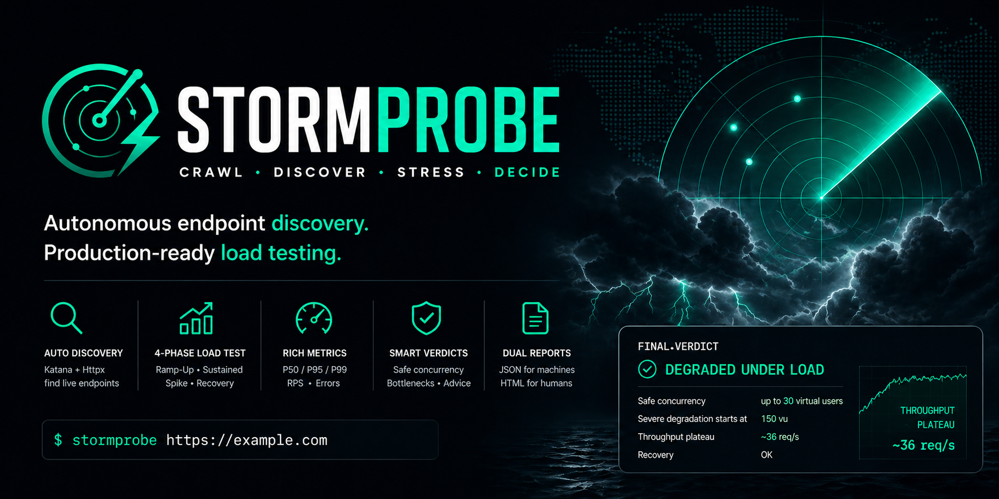

[English](../../README.md) · [Türkçe](README.tr.md) · [Deutsch](README.de.md) · [Francais](README.fr.md) · [Espanol](README.es.md) · [Italiano](README.it.md) · [Portugues](README.pt-BR.md) · [Russkij](README.ru.md) · [Zhongwen Jian](README.zh-CN.md) · [Zhongwen Fan](README.zh-TW.md) · [Nihongo](README.ja.md) · [Hangugeo](README.ko.md) · [Al-Arabiyya](README.ar.md) · [Hindi](README.hi.md) · [Nederlands](README.nl.md) · [Polski](README.pl.md) · [Ukrainska](README.uk.md)

# StormProbe

<p align="center">
  
</p>

**obnaruzhit'. nagruzit'. proanalizirovat'.**

HTTP-instrument nagruzochnogo testirovanija proizvodstvennogo urovnja s avtonomnym obnaruzhenijem endpoint (konechnykh tochek). Nol' zavisimostej.

[](https://github.com/umutozen/stormprobe/actions)
[](https://goreportcard.com/report/github.com/umutozen/stormprobe)

---

## Vozmozhnosti

- **Avtomaticheskoje obnaruzhenije** -- Skanirovanije Katana + zond Httpx avtomaticheski nakhodit aktivnyje endpoint'y
- **Mnogofaznoye testirovanije** -- Ramp-Up (postupnoye uvelichenije), Sustained (ustojchivoye), Spike (pik nagruzki), Recovery (vosstanovlenije)
- **Podrobnyje metriki** -- P50 / P95 / P99 latency (zaderzhka), req/s, klassifikacija oshibok
- **Dvojnoj otchot** -- JSON (mashinochitajemyj) + HTML (vizual'naja panel' s tomnoj temoj)
- **Nol' zavisimostej** -- Chistaja standartnaja biblioteka Go, bez storonnih modulej
- **Gotov dlja Docker** -- Odna komanda s vstroyennymi Katana + Httpx
- **Krossplatformennyj** -- Binarnyje fajly dlja Linux, macOS, Windows cherez GoReleaser

## Bystryj start

```bash
go run ./cmd https://example.com

go build -o stormprobe ./cmd
./stormprobe --insecure https://example.com
```

### Docker

```bash
# Quick test, no report saved
docker run --rm ghcr.io/umutozen/stormprobe:latest --insecure https://example.com

# Full test with reports saved to ./outputs (Linux / macOS)
docker run --rm -v $(pwd)/outputs:/app/outputs ghcr.io/umutozen/stormprobe:latest --insecure --format both https://example.com

# Full test with reports saved to ./outputs (Windows PowerShell)
docker run --rm -v "${PWD}\outputs:/app/outputs" ghcr.io/umutozen/stormprobe:latest --insecure --format both https://example.com

# High-load spike test (500 concurrent users)
docker run --rm ghcr.io/umutozen/stormprobe:latest --insecure --concurrency-spike 500 https://example.com

# Skip discovery, test root path only
docker run --rm ghcr.io/umutozen/stormprobe:latest --insecure --no-discovery https://example.com
```

## Ispol'zovanije

```
stormprobe [flags] <target-url>

Flags:
  --concurrency-ramp      int       Peak concurrency for ramp-up (default 50)
  --concurrency-sustained int       Concurrency for sustained phase (default 75)
  --concurrency-spike     int       Peak concurrency for spike (default 250)
  --req-per-worker        int       Requests per worker per step (default 15)
  --timeout               duration  Per-request timeout (default 10s)
  --endpoints             string    Endpoints file (one path per line, skips discovery)
  --no-discovery                    Skip katana+httpx, test root path only
  --output                string    Output directory for reports (default ./outputs)
  --format                string    Report format: json, html, both (default both)
  --katana-path           string    Custom katana binary path
  --httpx-path            string    Custom httpx binary path
  --insecure                        Skip TLS certificate verification
```

### Primery

```bash
stormprobe --insecure --concurrency-spike 500 --req-per-worker 20 https://example.com

stormprobe --insecure --endpoints endpoints.txt https://example.com

stormprobe --insecure --format json --output ./results https://example.com
```

## Fazy testirovanija

| Faza | Opisanije |
|---|---|
| **0 -- Discovery** | Skanirovanije Katana + zond Httpx, deduplicirovanyj spisok endpoint'ov |
| **1 -- Ramp-Up** | Postupnoye uvelichenije: 5, 15, 30, 50 virtual users (virtual'nyje pol'zovateli) |
| **2 -- Sustained** | 3 volny pri celevoj concurrency (odnovremennosti), izmerajet degradaciju |
| **3 -- Spike** | Vnezapnyj vsplesk do pika, zatem okhlazhdenie |
| **4 -- Recovery** | Proverka sostojanija posle spike cherez 10s okhlazhdenia |

## Vykhod

| Fajl | Opisanije |
|---|---|
| `stormprobe_report_<timestamp>.json` | Mashinochitajemyje rezul'taty so vsemi metrikami |
| `stormprobe_report_<timestamp>.html` | Vizual'naja panel', otkrojte v ljubom brauzere |

## Struktura proekta

```
stormprobe/
    cmd/main.go                    Tochka vkhoda CLI
    internal/
        config/config.go           Obshchije tipy, generatory faz
        metrics/
            latency.go             Vychislenije percentiley
            errors.go              Klassifikacija oshibok
        discovery/
            discovery.go           Publichnyj interfejs Discover()
            katana.go              Integracija kraulera Katana
            httpx.go               Integracija zonda Httpx
        runner/
            phase.go               Orkestrovka faz
            worker.go              Pul goroutin, RNG na worker
        report/
            json.go                Pisatel' otchota JSON
            html.go                Avtonomnyj HTML-otchot
    Dockerfile                     Mnogoetapnyj s Katana + Httpx
    .goreleaser.yml                Konfiguracija kross-kompiljacii
    Makefile                       Celi build, test, lint
    config.example.yml             Spravka po umolchanijem faz
```

## Trebovanija

- Go 1.21+
- [Katana](https://github.com/projectdiscovery/katana) (ProjectDiscovery) -- neobazatel'no, dlja avtomaticheskogo obnaruzhenia
- [Httpx](https://github.com/projectdiscovery/httpx) (ProjectDiscovery) -- neobazatel'no, dlja validacii endpoint'ov

```bash
bash scripts/install-tools.sh
```

## Otkazot otvetstvennosti

Etot instrument prednaznachen iskljuchitel'no dlja **avtorizovannogo testirovanija bezopasnosti i ocenki proizvoditel'nosti**. Vy dolzhny poluchit' javnoje pis'mennoje razreshenije ot vladelca celevoj sistemy pered zapuskom ljubykh nagruzochnykh testov. Nesankcionirovannoye ispol'zovanije etogo instrumenta protiv sistem, kotoryje vam ne prinadlezhat ili na testirovanije kotorykh u vas net razreshenija, mozhet narushit' mestnyje, nacionalnyje ili mezhdunarodnyje zakony. Avtory ne nesut otvetstvennosti za nepravil'noye ispol'zovanije ili ushcherb, prichinjonnyj etim instrumentom.

## Licenzija

MIT

## Avtor

**Umut ÖZEN** -- [@umutozen](https://github.com/umutozen)
